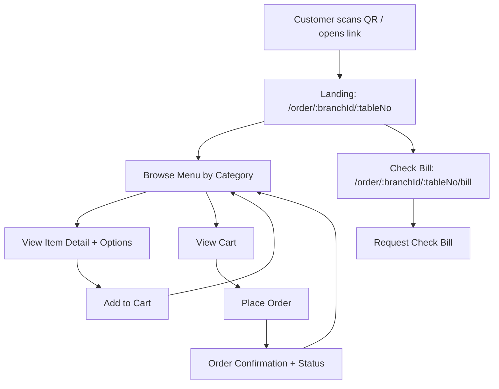
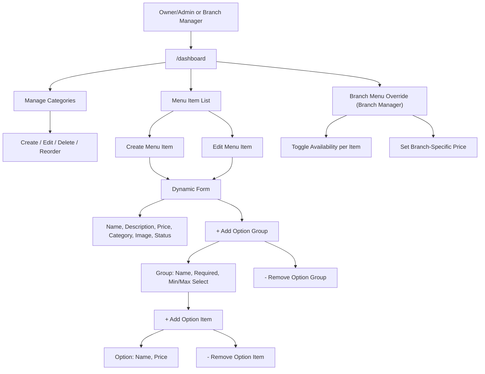
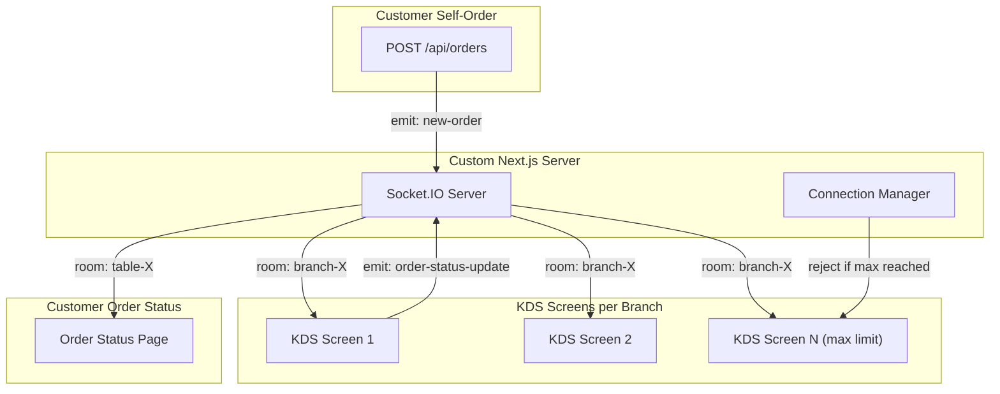

# RMS: Self-Order, KDS & Menu Management

## Overview

Build the End User self-order and check bill, real-time KDS with Socket.IO and per-branch screen limits, and Menu Management with dynamic form UI for Owner/Admin and Branch Manager -- all using Next.js full-stack with PostgreSQL and Drizzle ORM.

> **Status:** Phase 1 **and** Phase 2 are implemented. See `docs/FEATURES.md` for a full feature summary. The sections below document the system as built.

## Scope -- Phase 1 (implemented)

- **Self-Order** (Customer-facing menu browsing, cart, order placement, bill)
- **KDS** (Kitchen display with real-time updates, station filtering, connection limits)
- **Menu Management** (Dashboard CRUD for categories, menu items, option groups, branch overrides)

## Scope -- Phase 2 (implemented)

- **Authentication & Authorization** -- cookie sessions, scrypt password hashing, role-based access (`requireAccess` guards + middleware)
- **POS** -- cashier workflow, shift management (open/close + drawer reconciliation), cash/card/QR payment processing, printable receipts
- **Reports** -- sales summaries & analytics dashboard (by day, category, top items, payment breakdown)
- **Sub-categories** -- self-referential `parentId` on categories (nested hierarchy)
- **Image upload** -- `POST /api/uploads` to `public/uploads`, reusable `ImageUpload` component (upload or URL)
- **Waitstaff** -- floor-service role: view all branches, add tables, monitor per-table order status, mark `ready` orders served

## To-Do List

1. **scaffold** -- Scaffold Next.js project with TypeScript, Tailwind CSS, and install dependencies (drizzle-orm, postgres, drizzle-kit, zod, socket.io, socket.io-client, react-aria-components, react-hook-form). UI is styled with a custom "Claude visual style" Tailwind theme.
2. **drizzle-schema** -- Create Drizzle schema (`src/db/schema.ts`) with all models (Restaurant, Branch, User, Table, TableSession, Category, MenuItem, BranchMenuItem, OptionGroup, OptionItem, Order, OrderItem, OrderItemOption, Bill, KdsStation). Include kdsStationId on MenuItem, deletedAt for soft delete, sortOrder on OptionGroup/OptionItem.
3. **seed-data** -- Write seed script (`src/db/seed.ts`) with sample restaurant, menu items, categories, options, tables, KDS stations, 1 admin User, and 1 branch manager User
4. **db-lib** -- Create Drizzle client singleton (`src/db/index.ts`) and utility functions (price formatting, VAT calculation)
5. **socket-server** -- Create custom Next.js server with Socket.IO integration, room-per-branch, and max connections enforcement
6. **api-storefront-menu** -- Build GET /api/storefront/menu?branchId=X for fetching available menu items grouped by category (customer-facing, filters hidden/sold_out, applies branch price overrides)
7. **api-tables-sessions** -- Build GET /api/tables?branchId=X, PATCH /api/tables/[id] (update status), POST /api/sessions (create table session), GET /api/sessions?tableId=X&status=active (get active session)
8. **api-orders** -- Build POST /api/orders (create order, auto-creates TableSession if none active) and GET /api/orders?tableId=X&status=active, GET /api/orders/[id] API routes -- emit new-order event via Socket.IO on creation
9. **api-bills** -- Build GET /api/bills?sessionId=X and POST /api/bills/request-check API routes. Bill links to TableSession (covers all orders in a session).
10. **cart-context** -- Create CartContext with add/remove/update/clear actions. Persists to localStorage scoped by `branchId:tableNo` key. Clears on successful order placement.
11. **menu-page** -- Build Menu browsing page with category tabs, menu cards, item detail modal with options. Fetches from GET /api/storefront/menu?branchId=X.
12. **cart-page** -- Build Cart page with item list, quantity controls, notes, and place order flow
13. **order-status-page** -- Build Order status page showing order progress with real-time WebSocket updates
14. **bill-page** -- Build Bill page with order summary, totals, and request check button
15. **kds-page** -- Build KDS page with real-time order board, status controls, station filter, FIFO ordering, overdue alerts, and per-branch connection limit with rejection message when max reached
16. **api-menu-crud** -- Build dashboard CRUD API routes: GET /api/menu?restaurantId=X (all items, all statuses), GET /api/menu/[id], POST /api/menu, PUT /api/menu/[id], DELETE /api/menu/[id] with Zod validation
17. **menu-mgmt-categories** -- Build Category management page -- list, create, edit, delete categories with sortOrder
18. **menu-mgmt-form** -- Build Menu Item create/edit form with dynamic option groups and option items (add/remove rows on the fly, no page reload)
19. **menu-mgmt-list** -- Build Menu Item list page with status toggle (available/sold_out/hidden), edit, delete actions
20. **branch-menu-override** -- Build Branch Manager menu override page -- toggle availability and set branch-specific price per item
21. **ui-polish** -- Polish UI: responsive mobile-first design, loading states, error handling, empty states

## Tech Stack

- **Framework:** Next.js 15 (App Router) with TypeScript
- **Database:** PostgreSQL (hosted on Supabase) with Drizzle ORM
- **Styling:** Tailwind CSS
- **UI Components:** React Aria Components (accessible, unstyled primitives from Adobe). Consider using shadcn/ui (built on Radix primitives + Tailwind) instead to reduce the effort of building and styling UI primitives from scratch. Decision to be made at scaffold time.
- **State Management:** React Context (for cart, for dashboard restaurant/branch context)
- **Real-Time:** Socket.IO (WebSocket) -- custom server for Next.js
- **Migrations:** drizzle-kit (`db:generate`, `db:migrate`, `db:push`, `db:studio`)
- **Validation:** Zod
- **Dynamic Forms:** React Hook Form + useFieldArray (for dynamic option groups/items)

## User Flows

### Customer Self-Order Flow



### Menu Management Flow (Owner/Admin + Branch Manager)



## Real-Time Architecture (Socket.IO)



### Socket.IO Events

- **`kds:join`** -- KDS screen connects to a branch room. Server checks concurrent limit before allowing.
- **`kds:reject`** -- Server rejects connection when branch has reached max KDS screens.
- **`order:new`** -- Emitted when a new order is placed. Broadcast to all KDS screens in the branch room.
- **`order:status-update`** -- KDS staff updates order status (pending -> preparing -> ready -> served). Broadcast to branch room + customer table room.
- **`order:item-status-update`** -- KDS staff updates individual item status. Broadcast similarly.
- **`kds:screen-count`** -- Broadcast current connected screen count to all KDS screens in a branch.

### Connection Limit Logic

- Each Branch has a `maxKdsScreens` setting (stored in `Branch.settings` JSON, default: 3).
- On `kds:join`, the server counts active sockets in `branch-kds-{branchId}` room.
- If count >= `maxKdsScreens`, emit `kds:reject` with a message and disconnect the socket.
- When a KDS screen disconnects, broadcast updated `kds:screen-count` to remaining screens.

## Database Schema (Drizzle)

Models are defined under `src/db/schema/` (one file per domain, re-exported from `src/db/schema/index.ts`). IDs are `uuid` (defaultRandom), money is `numeric(10,2)`, enums use `pgEnum`, `Branch.settings` is `jsonb`:

- **Restaurant** -- id, name, logo, createdAt
- **Branch** -- id, restaurantId, name, address, settings (JSON -- includes `maxKdsScreens` default 3, `vatRate` default 0.07, `serviceChargeRate` default 0)
- **User** -- id, email, name, passwordHash, role (owner/admin/branch_manager/cashier/kitchen_staff/**waitstaff**), restaurantId, branchId (nullable), createdAt
- **Session** -- id (also the opaque cookie token), userId, expiresAt, createdAt
- **Table** -- id, branchId, tableNumber, status (available/occupied)
- **TableSession** -- id, branchId, tableId, status (active/closed), createdAt, closedAt
- **Category** -- id, restaurantId, **parentId (nullable, self-FK for sub-categories)**, name, sortOrder, image
- **MenuItem** -- id, restaurantId, name, description, price, image, categoryId, kdsStationId (nullable FK to KdsStation), status (available/sold_out/hidden), deletedAt (nullable)
- **BranchMenuItem** -- id, branchId, menuItemId, price (override), isAvailable
- **OptionGroup** -- id, menuItemId, name, required, minSelect, maxSelect, sortOrder
- **OptionItem** -- id, optionGroupId, name, price, sortOrder
- **Order** -- id, branchId, tableId, tableSessionId (FK to TableSession), orderNumber, status (pending/preparing/ready/served/completed/cancelled), type (dine_in/take_away), totalAmount, createdAt, cancelledAt (nullable), cancelReason (nullable). Cancelled orders are excluded from the bill.
- **OrderItem** -- id, orderId, menuItemId, quantity, unitPrice, note
- **OrderItemOption** -- id, orderItemId, optionItemId, price
- **Bill** -- id, tableSessionId (FK to TableSession), subtotal, vat, serviceCharge, discount, totalAmount, status (open/requested/paid), createdAt
- **KdsStation** -- id, branchId, name (e.g., "Hot Kitchen", "Cold Kitchen", "Drinks"), sortOrder
- **Shift** (POS) -- id, branchId, cashierId, status (open/closed), openingFloat, closingAmount (nullable), note, openedAt, closedAt (nullable)
- **Payment** (POS) -- id, billId, shiftId (nullable), cashierId (nullable), method (cash/card/qr), amount, tendered (nullable), change (nullable), createdAt

### Auth & RBAC

- Session cookie (`rms_session`, httpOnly) backed by the **Session** table; scrypt password hashing (`src/lib/password.ts`).
- `src/lib/auth.ts` exposes `getCurrentUser`, `createSession`/`destroySession`, and the `AREA_ROLES` access map; `src/lib/guard.ts` `requireAccess(area)` is used in server layouts. `src/middleware.ts` redirects unauthenticated users from protected paths.
- **Area access:** dashboard & reports → owner/admin/branch_manager · pos → owner/admin/cashier · kds → owner/admin/branch_manager/kitchen_staff · waitstaff → owner/admin/branch_manager/waitstaff.

## Project Structure

```
rms/
├── drizzle/                  (generated SQL migrations)
├── drizzle.config.ts         (uses DIRECT_URL for migrations)
├── server.ts
├── src/
│   ├── middleware.ts            (auth cookie gate for protected paths)
│   ├── app/
│   │   ├── layout.tsx           (wraps app in AuthProvider)
│   │   ├── page.tsx
│   │   ├── login/page.tsx       (sign in)
│   │   ├── forbidden/page.tsx   (role-denied)
│   │   ├── order/[branchId]/[tableNo]/
│   │   │   ├── page.tsx          (Menu browsing)
│   │   │   ├── cart/page.tsx     (Cart)
│   │   │   ├── bill/page.tsx     (Check bill)
│   │   │   └── status/page.tsx   (Order status)
│   │   ├── dashboard/
│   │   │   ├── layout.tsx                 (auth guard + plain shell)
│   │   │   ├── page.tsx                   (restaurants index: view / edit / delete)
│   │   │   ├── new/page.tsx               (create restaurant + ≥1 branch)
│   │   │   └── [restaurantId]/
│   │   │       ├── layout.tsx             (RestaurantProvider scoped to :restaurantId + Sidebar)
│   │   │       ├── page.tsx               (overview: edit restaurant)
│   │   │       ├── branches/page.tsx
│   │   │       ├── categories/page.tsx    (incl. sub-categories)
│   │   │       ├── menu/page.tsx
│   │   │       ├── menu/create/page.tsx
│   │   │       ├── menu/[id]/edit/page.tsx
│   │   │       ├── branch-menu/page.tsx
│   │   │       └── reports/page.tsx       (sales analytics)
│   │   ├── kds/ (layout.tsx [guard] + [branchId]/page.tsx)
│   │   ├── pos/ (layout.tsx [guard] + [branchId]/page.tsx)
│   │   └── waitstaff/ (layout.tsx [guard] + page.tsx [resolver] + [branchId]/page.tsx)
│   ├── api/
│   │   ├── auth/ (login, logout, me)
│   │   ├── menu/route.ts & [id]/route.ts        (dashboard CRUD)
│   │   ├── storefront/menu/route.ts              (customer-facing, public)
│   │   ├── restaurants/route.ts & [id]/route.ts
│   │   ├── branches/route.ts & [id]/route.ts
│   │   ├── categories/route.ts & [id]/route.ts
│   │   ├── branch-menu/route.ts
│   │   ├── orders/route.ts & [id]/route.ts & [id]/status/route.ts & [id]/cancel/route.ts
│   │   ├── tables/route.ts & [id]/route.ts
│   │   ├── sessions/route.ts
│   │   ├── bills/route.ts
│   │   ├── shifts/route.ts & [id]/close/route.ts (POS)
│   │   ├── payments/route.ts                      (POS)
│   │   ├── pos/sessions/route.ts                  (POS worklist)
│   │   ├── reports/sales/route.ts
│   │   └── uploads/route.ts                        (image upload)
│   ├── components/
│   │   ├── menu/ (CategoryTabs, MenuCard, MenuItemDetail)
│   │   ├── dashboard/ (Sidebar, MenuItemForm, …)
│   │   ├── pos/ (ShiftBar, PaymentModal, Receipt)
│   │   ├── kds/ (KdsOrderCard, …)
│   │   └── ui/ (Button, Badge, Modal, Select, TextField, NumberField, Switch, Tabs, Table, AccountMenu, ImageUpload, States)
│   ├── contexts/
│   │   ├── CartContext.tsx
│   │   ├── AuthContext.tsx
│   │   └── RestaurantContext.tsx
│   ├── db/ (schema/ [per-domain files], index.ts [client singleton], seed.ts)
│   ├── lib/ (socket.ts, socket-client.ts, utils.ts, auth.ts, guard.ts, password.ts, session-cookie.ts, bills.ts, validation.ts, …)
│   └── types/ (index.ts, pos.ts)
├── package.json
├── tsconfig.json
├── tailwind.config.ts
└── .env
```

## API Endpoints

### Conventions

- All list endpoints support `?page=1&limit=20` query params (default limit: 20, max: 100)
- Standardized error response format:
  ```json
  { "error": { "code": "VALIDATION_ERROR", "message": "...", "details": [...] } }
  ```
- Order status transitions are validated: `pending → preparing → ready → served → completed`. Invalid transitions return 400. An order may also be **cancelled** from `pending` or `preparing` only (not once `ready`/`served`/`completed`).

### Restaurants & Branches (Dashboard)

- **GET `/api/restaurants`** -- List all restaurants (`?withBranches=true` includes each restaurant's branches)
- **POST `/api/restaurants`** -- Create restaurant (name, logo) **with at least one branch** (`branches[]`, min 1). Restaurant + branches are inserted in a single transaction; a request with zero branches is rejected (400).
- **GET `/api/restaurants/[id]`** -- Get a single restaurant (`?withBranches=true` includes its branches; used by the dashboard scope provider)
- **PUT `/api/restaurants/[id]`** -- Update restaurant
- **DELETE `/api/restaurants/[id]`** -- Delete restaurant (fails if branches exist)
- **GET `/api/branches?restaurantId=X`** -- List branches for a restaurant
- **POST `/api/branches`** -- Create branch (restaurantId, name, address, settings)
- **GET `/api/branches/[id]`** -- Get single branch
- **PUT `/api/branches/[id]`** -- Update branch (name, address, settings)
- **DELETE `/api/branches/[id]`** -- Delete branch (fails if the branch has orders)

### Menu Management (Dashboard)

- **GET `/api/categories?restaurantId=X`** -- List all categories (includes `parentId`)
- **POST `/api/categories`** -- Create category (name, sortOrder, image, optional `parentId` for sub-categories)
- **PUT `/api/categories/[id]`** -- Update category (incl. `parentId`; rejects self-parent)
- **DELETE `/api/categories/[id]`** -- Delete category (fails if menu items exist)
- **GET `/api/menu?restaurantId=X`** -- List all menu items (all statuses, for management)
- **POST `/api/menu`** -- Create menu item with nested option groups and option items in one request
- **GET `/api/menu/[id]`** -- Get single menu item with all option groups/items (for edit form)
- **PUT `/api/menu/[id]`** -- Update menu item + replace option groups/items (upsert strategy)
- **DELETE `/api/menu/[id]`** -- Soft delete menu item (sets deletedAt)
- **GET `/api/branch-menu?branchId=X`** -- Get all menu items with branch overrides
- **PUT `/api/branch-menu`** -- Bulk update branch-specific availability and prices

### Customer-Facing (Storefront)

- **GET `/api/storefront/menu?branchId=X`** -- Get all available menu items grouped by category for a branch (filters hidden/sold_out/deleted, applies branch price overrides)

### Tables & Sessions

- **GET `/api/tables?branchId=X`** -- List tables for a branch
- **PATCH `/api/tables/[id]`** -- Update table status (available ↔ occupied)
- **POST `/api/sessions`** -- Create a new table session (body: branchId, tableId)
- **GET `/api/sessions?tableId=X&status=active`** -- Get active session for a table

### Orders

- **POST `/api/orders`** -- Create a new order (body: branchId, tableId, items). Auto-creates TableSession if none active. Emits `order:new` via Socket.IO to KDS.
- **GET `/api/orders?tableId=X&status=active`** -- Get active orders for a table. With `branchId`, also supports `active=true` (KDS set: pending/preparing/ready) or `statuses=a,b,c` (explicit CSV filter, e.g. waitstaff monitoring served orders too).
- **GET `/api/orders/[id]`** -- Get single order with items and options
- **PATCH `/api/orders/[id]/status`** -- Update order status (used by KDS). Validates state transition. Emits `order:status-update` via Socket.IO.
- **POST `/api/orders/[id]/cancel`** -- Cancel an order (body: optional `reason`). Allowed only while `pending` or `preparing`; sets status `cancelled` + `cancelledAt` + `cancelReason`. Emits `order:status-update` to the branch KDS and customer table. Used by both KDS staff and customers (customer cancel limited to `pending`).

### Bills

- **GET `/api/bills?sessionId=X`** -- Get bill for a table session (covers all orders)
- **POST `/api/bills/request-check`** -- Request check bill (changes bill status to requested)

### Auth (Phase 2)

- **POST `/api/auth/login`** -- Email + password; sets the session cookie, returns the user
- **POST `/api/auth/logout`** -- Destroys the session and clears the cookie
- **GET `/api/auth/me`** -- Returns the current user (or null)

### POS (Phase 2)

- **GET `/api/shifts?branchId=X&status=open`** -- List shifts with payment/cash totals and expected drawer cash
- **POST `/api/shifts`** -- Open a shift (idempotent per cashier+branch); cashier taken from session
- **POST `/api/shifts/[id]/close`** -- Close a shift (body: `closingAmount`, optional `note`)
- **GET `/api/pos/sessions?branchId=X`** -- Active table sessions with running totals + bill status (cashier worklist)
- **POST `/api/payments`** -- Take payment for a session: recompute bill, optional `discount`, `method` (cash/card/qr), `tendered`; marks bill paid, closes session, frees table, attributes to shift; returns receipt data

### Reports (Phase 2)

- **GET `/api/reports/sales?branchId=X&from=&to=`** -- Sales analytics (summary, by day, payment breakdown, by category, top items) from recorded payments

### Uploads (Phase 2)

- **POST `/api/uploads`** -- Multipart `file` field; stores under `public/uploads` (≤5 MB, png/jpg/webp/gif); returns `{ url }`

## Frontend Pages

### 1. Menu Page (`/order/[branchId]/[tableNo]`)
- Header with restaurant name + table number
- Horizontal scrollable category tabs
- Grid of menu cards (image, name, price, sold-out badge)
- Tap card opens item detail modal with options/add-ons
- Floating cart button with item count badge
- Fetches from `GET /api/storefront/menu?branchId=X`

### 2. Cart Page (`/order/[branchId]/[tableNo]/cart`)
- List of selected items with quantity +/- controls
- Selected options displayed under each item
- Note field per item
- Subtotal, VAT, service charge display (rates from branch settings)
- "Place Order" button

### 3. Order Status Page (`/order/[branchId]/[tableNo]/status`)
- Shows current order(s) with status badges (pending / preparing / ready / served)
- Real-time updates via Socket.IO -- joins `table-{tableId}` room, listens to `order:status-update`
- "Cancel order" button shown only while the order is still `pending`
- "Order More" button to go back to menu

### 4. Bill Page (`/order/[branchId]/[tableNo]/bill`)
- Summary of all orders for the table session (via TableSession)
- Line items with quantity and price
- Subtotal, VAT, service charge, discount, total
- "Request Check" button (notifies staff)
- Status indicator (open / check requested / paid)

### 5a. Dashboard - Restaurants Index (`/dashboard`)
- "New restaurant" button links to the create page; inline edit form (name, logo URL) + delete (blocked if branches exist)
- Each restaurant links/`Manage` button to `/dashboard/:restaurantId`

### 5a-i. Dashboard - Create Restaurant (`/dashboard/new`)
- Standalone page (outside the `:restaurantId` scope). Restaurant fields (name, logo) + a dynamic list of branches
- **At least one branch is required**; each branch row has name, address, and settings (max KDS, VAT %, service %). Add/remove branches client-side; min 1 enforced both client- and server-side
- On success, redirects to `/dashboard/:restaurantId` for the new restaurant

### 5b. Dashboard - Restaurant Overview (`/dashboard/:restaurantId`)
- Edit the restaurant (name, logo); summary stats; quick links to branches/categories/menu

### 5c. Dashboard - Branch Management (`/dashboard/:restaurantId/branches`)
- Inline create/edit/delete branches (name, address, settings: max KDS, VAT %, service %)
- Delete blocked if the branch has orders

### 5. Dashboard - Category Management (`/dashboard/:restaurantId/categories`)
- List of categories with name and sort order
- Inline create/edit form (no separate page)
- Delete with confirmation (blocked if category has menu items)

### 6. Dashboard - Menu Item List (`/dashboard/:restaurantId/menu`)
- Table/grid of all menu items showing: name, category, price, status
- Quick status toggle dropdown (available / sold_out / hidden)
- Edit and Delete action buttons
- "Create New Item" button

### 7. Dashboard - Create/Edit Menu Item (`/dashboard/:restaurantId/menu/create` and `/dashboard/:restaurantId/menu/[id]/edit`)
- Dynamic form page, powered by React Hook Form + useFieldArray
- Basic fields: name, description, base price, category (dropdown), image URL, status, KDS station assignment
- Option Groups section: starts empty, with an "+ Add Option Group" button
  - Each group row has: group name, required toggle, min select, max select, remove button
  - Inside each group: list of option items with "+ Add Option" button
  - Each option item row has: option name, additional price, remove button
- All add/remove operations happen instantly in the browser
- Single "Save" button submits the entire menu item + all option groups + all option items in one API request
- Validation: Zod schema validates the nested structure client-side before submit

### 8. Dashboard - Branch Menu Override (`/dashboard/:restaurantId/branch-menu`)
- Table of all master menu items for the branch selected in the sidebar
- Per-item toggle: available on/off for this branch
- Per-item price override field (blank = use master price)
- Bulk save button

### 9. KDS Page (`/kds/[branchId]`)
- Real-time order board -- connects via Socket.IO to `branch-kds-{branchId}` room
- Connection limit enforcement -- on connect, server checks active KDS screen count vs `maxKdsScreens`; if limit reached, shows rejection screen
- Connection status bar -- shows "Screen 2 of 3 connected" with live count
- Order cards in grid layout -- each card shows: order number, table number, time elapsed (timer), items with options, order type
- Status controls -- tap to advance: pending -> preparing -> ready -> served. A Cancel button (shown while pending/preparing) cancels the order with an optional reason; cancelled orders drop off the board.
- Station filter tabs -- filter orders by KDS station (All, Hot Kitchen, Cold Kitchen, Drinks)
- FIFO ordering -- orders sorted by creation time, oldest first
- Overdue alert -- cards turn red + flash when order exceeds threshold (default 15 min)
- Responsive -- optimized for tablet/large screen landscape mode

### Dashboard Routing & Context

- **`/dashboard`** -- restaurants index. Create a restaurant, view/edit/delete restaurants. Each row links to `/dashboard/:restaurantId`. This page is **not** wrapped in `RestaurantProvider` (it fetches `GET /api/restaurants?withBranches=true` directly).
- **`/dashboard/:restaurantId`** -- per-restaurant management area. The segment's `layout.tsx` wraps children in `RestaurantProvider` (scoped to the route's `restaurantId`) and renders the `Sidebar`. Pages: overview (edit restaurant), branches CRUD, categories CRUD, menu CRUD, and branch-menu overrides.
- `RestaurantProvider` takes `restaurantId` from the route, loads the restaurant + its branches via `GET /api/restaurants/:id?withBranches=true`, and exposes `branchId`/`setBranch`/`refresh()` plus the selected branch's `settings` and KDS `stations`.
- The **branch** selection is persisted to `localStorage` per restaurant (`rms.branch.<restaurantId>`), defaulting to the restaurant's first branch. KDS stations are re-fetched whenever the active branch changes. The sidebar renders the branch `Select`.
- The landing page (`/`) still uses `GET /api/bootstrap` only to build demo entry links.
- Context lives in `src/contexts/RestaurantContext.tsx`.

## Seed Data

- 1 Restaurant ("Demo Restaurant")
- 1 Branch with settings (`maxKdsScreens: 3`, `vatRate: 0.07`, `serviceChargeRate: 0`)
- 5 Users (all password `password123`): `admin@demo.test` (admin), `manager@demo.test` (branch_manager), `cashier@demo.test` (cashier), `kitchen@demo.test` (kitchen_staff), `waiter@demo.test` (waitstaff). Passwords are scrypt-hashed.
- 5 Tables
- 3 Categories (Appetizers, Main Course, Beverages)
- 8-10 Menu items with images (placeholder URLs)
- Option groups (spice level, toppings, size) with sortOrder
- 3 KDS Stations (Hot Kitchen, Cold Kitchen, Drinks)
