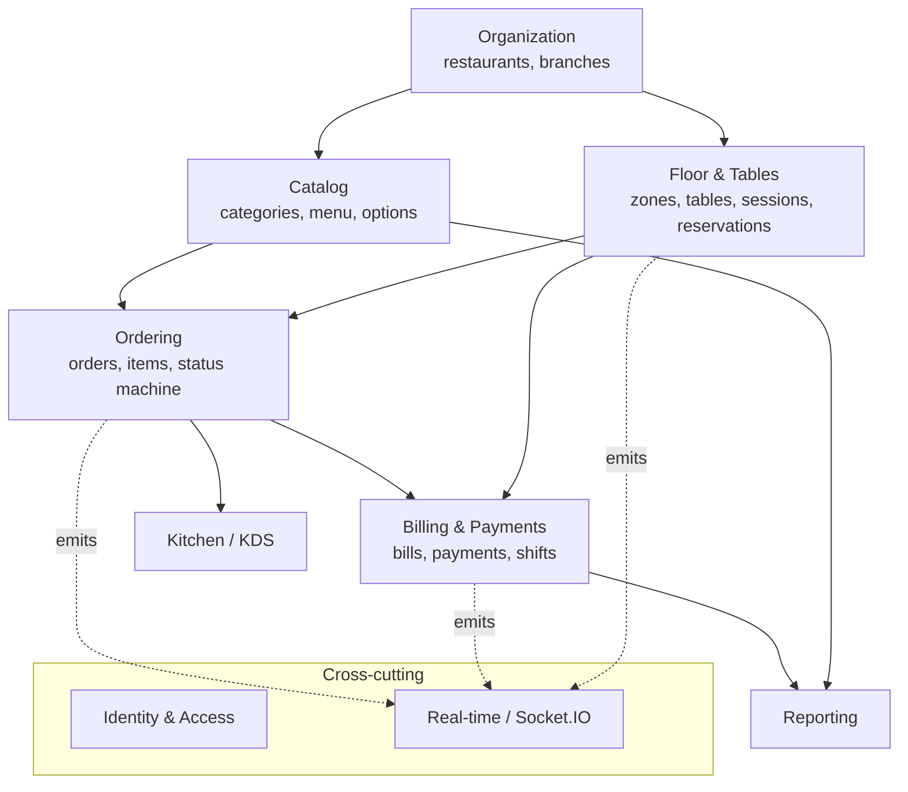

# RMS Architecture — Modular Monolith

This document records the architecture decision for the RMS API layer and the
practices that keep the codebase ready to scale **without** prematurely
splitting it into microservices. Per-domain documentation lives in
[`domains/`](domains/).

## Decision: stay a modular monolith

RMS is a Next.js full-stack app with a custom Node server (`server.ts`) that
hosts both the HTTP API and the Socket.IO real-time layer in one process,
backed by a single PostgreSQL database.

We deliberately **do not** split the API into microservices, because:

1. **Core flows are cross-domain transactions.** Settlement
   (`POST /api/payments`) atomically upserts the bill, records the payment,
   closes the table session, frees the table, and completes served orders —
   one `db.transaction`. Table move (`POST /api/sessions/:id/move`) atomically
   re-points a session, its orders, and both tables, with a concurrency guard.
   Splitting these across services would require sagas/distributed
   transactions for zero feature gain.
2. **Real-time depends on shared process state.** The KDS connection limit
   counts live sockets in an in-memory room; emit helpers reach the Socket.IO
   instance via `globalThis`. This is simple and correct in one process.
3. **Team size and traffic don't justify the operational cost** (service
   discovery, contract versioning, distributed tracing, N deploy pipelines).

Instead we keep the monolith **modular**: clear domain ownership, a service
layer per domain, and one well-defined seam (real-time) for the first
scale-out step. The sections below are the three working rules.

## Rule 1 — Service layer per domain (routes stay thin) ✅ implemented

**Goal:** every route handler does only *parse → guard → call service →
serialize*. All business logic lives in per-domain service modules.

**Status — done for every route.** All business/data logic now lives in
`src/services/`; route handlers only parse, guard, call a service, and
serialize. Service modules, by domain:

| Domain | Service module | Functions |
|--------|----------------|-----------|
| Orders | `services/orders.ts` | `placeOrder`, `transitionOrder`, `cancelOrder`, `listOrders`, `getOrder`, `updateOrderItem`, `removeOrderItem` |
| Billing & Payments | `services/payments.ts`, `services/bills.ts` | `settleSession` · `getSessionBill`, `requestCheck` |
| Sessions | `services/sessions.ts` | `openSession`, `getTableSession`, `checkSessionAccess`, `moveSession`, `cancelSession` |
| Reservations | `services/reservations.ts` | `listReservations`, `createReservation`, `seatReservation`, `cancelReservation` |
| Catalog | `services/menu.ts`, `services/categories.ts` | menu CRUD + `getStorefrontMenu` + branch-menu · category CRUD |
| Organization | `services/restaurants.ts`, `services/branches.ts` | restaurant & branch CRUD (`DEFAULT_BRANCH_SETTINGS` shared) |
| Floor & Tables | `services/tables.ts`, `services/floor.ts` | table CRUD + `saveTableLayout` · zone CRUD |
| POS | `services/shifts.ts`, `services/pos.ts` | `listShifts`, `openShift`, `closeShift` · `listPosSessions` |
| Reporting | `lib/reports.ts` | `computeSalesReport`, `computeBranchSalesReport`, `resolveReportRange` |
| Kitchen / KDS | `services/kds.ts` | `listKdsStations` |
| Identity | `services/auth.ts` | `login` (logout/me call `lib/auth` directly) |
| Misc | `services/bootstrap.ts`, `services/uploads.ts` | `getBootstrap` · `uploadImage` |

Pure read-model + rule helpers stay in `src/lib/`: `orders.ts` (status machine,
DTO assembly), `bills.ts` (`computeSessionBill`), `reservations.ts` (blocking
checks), `reports.ts` (report builders), `auth.ts` (session/RBAC primitives).

**Sole exception:** `POST /api/reports/agent` is a streaming Claude integration
(returns a `ReadableStream`, not JSON) — it keeps its prompt-building inline as
it has no DB/domain logic to extract.

**Conventions (follow these for new use cases):**

- Write-flow orchestrations go in `src/services/<domain>.ts`; pure read models
  stay in `src/lib/<domain>.ts`. Each function takes already-validated input
  and returns a DTO — it never touches `Request`/`Response`.
- **Errors:** services throw `ServiceError(code, message, status, details?)`
  from `src/services/errors.ts`; routes reduce their catch block to
  `return handleError(err, "<METHOD> /api/...")` (`src/lib/api.ts`), which maps
  a `ServiceError` to the standard envelope and anything else to a logged 500.
- Zod schemas stay in `src/lib/validation.ts`; route handlers own HTTP concerns
  (status codes, `parseBody`, `requireAccess`) and nothing else.
- Side effects (Socket.IO emits) happen at the end of the use-case function,
  after the transaction commits — never inside it. The request's
  `x-rms-socket-id` is passed in as an `originSocketId` option.

  Routes that need the signed-in user fetch it (`getCurrentUser`) and pass it
  to the service (e.g. `createReservation(data, user)`, `openShift(data, user)`)
  — auth is an HTTP concern, attribution is the service's.
- **Status codes:** idempotent create/open use cases return a `created` flag so
  the route picks `201` vs `200` (`openSession`, `openShift`).

**Why it pays off now:** use cases are unit-testable without HTTP, reusable
from other entry points (reports agent, future jobs/webhooks), and each service
module is the exact seam where a future extraction would cut.

**`parseBody` returns the schema's output type** (`z.output`, post-defaults), so
a route can hand its parsed `data` straight to the matching service whose param
is `z.infer<typeof schema>`. Service input aliases live in `lib/validation.ts`.

## Rule 2 — Domain boundaries: owned tables, exported functions, shared `tx`

**Goal:** each domain owns its tables; other domains reach that data through
the owning domain's exported functions, not by querying the tables directly.

Ownership is documented per domain in [`domains/`](domains/) (see the "Owned
data" section of each file). Examples: only **Billing & Payments** writes
`bills`/`payments`; only **Ordering** writes `orders` and enforces
`canTransition`; only **Floor & Tables** flips `tables.status`.

**Practice:**

- **Reads across domains** go through exported query helpers
  (`loadOrderDTO`, `computeSessionBill`, `getBlockingReservation`) — never ad
  hoc joins into another domain's tables from a route.
- **Writes across domains** happen in an *orchestrating* use-case function
  that calls each domain's mutation helpers, passing the Drizzle `tx` handle
  so the whole flow stays one atomic transaction. The single shared database
  is a monolith advantage — keep atomicity, but route the writes through the
  owning domain's code so invariants (status machines, reservation buffers)
  live in exactly one place.
- New tables get an owner the day they are created; the schema file layout
  (`src/db/schema/<domain>.ts`) mirrors the domain map.

**Why it pays off now:** business rules can't drift into N copies, and the
dependency graph stays acyclic and visible (see map below) — which is also
the prerequisite for ever extracting a domain cleanly.

## Rule 3 — Real-time is the first (and only planned) extraction seam

**Goal:** keep every Socket.IO touchpoint behind `src/lib/socket.ts` so the
real-time layer can move out of the web process without touching domain code.

The Socket.IO server is the only *stateful* component blocking horizontal
scale of the web tier (sticky in-memory rooms; the KDS limit counts sockets in
a room). The codebase is already well-positioned: room naming and all emit
helpers (`emitNewOrder`, `emitOrderStatusUpdate`, `emitBillPaid`,
`emitTableMoved`, `emitSessionCancelled`, `emitReservationUpdate`,
`emitBillRequested`) are centralized in `src/lib/socket.ts`, and event
payloads are typed in `src/types`.

**Practice:**

- **Never** call `getIO()` outside `src/lib/socket.ts`; domain code only calls
  the named emit helpers. Adding an event means adding a typed payload in
  `src/types` and one helper in `socket.ts`.
- Emits are best-effort notifications, never load-bearing: the DB is the
  source of truth and clients re-fetch on reconnect.

**When scale actually demands it,** the extraction is mechanical: run
Socket.IO in its own process with the Redis adapter, and swap the emit
helpers' implementation to publish over Redis instead of calling the local
instance. The KDS connection-limit count must become adapter-aware
(`fetchSockets()` across nodes) at the same time. No route, service, or
client code changes. Do **not** split API domains into services before this —
this seam delivers the scaling headroom at a fraction of the cost.

## Domain map

Arrows point from a domain to the domains that depend on it. Dependencies flow
one way; a lower domain never imports from a higher one (e.g. Catalog never
knows about Ordering).

## Domain index

| Domain | Doc | Owned schema files |
|--------|-----|--------------------|
| Identity & Access | [domains/identity-access.md](domains/identity-access.md) | `user.ts`, `session.ts` |
| Organization | [domains/organization.md](domains/organization.md) | `restaurant.ts`, `branch.ts` |
| Catalog | [domains/catalog.md](domains/catalog.md) | `category.ts`, `menu.ts` |
| Floor & Tables | [domains/floor-tables.md](domains/floor-tables.md) | `floor.ts`, `table.ts`, `reservations.ts` |
| Ordering | [domains/ordering.md](domains/ordering.md) | `order.ts` |
| Kitchen / KDS | [domains/kitchen-kds.md](domains/kitchen-kds.md) | `kds.ts` |
| Billing & Payments | [domains/billing-payments.md](domains/billing-payments.md) | `bill.ts`, `pos.ts` |
| Reporting | [domains/reporting.md](domains/reporting.md) | — (reads others) |
| Real-time | [domains/realtime.md](domains/realtime.md) | — (infrastructure) |
