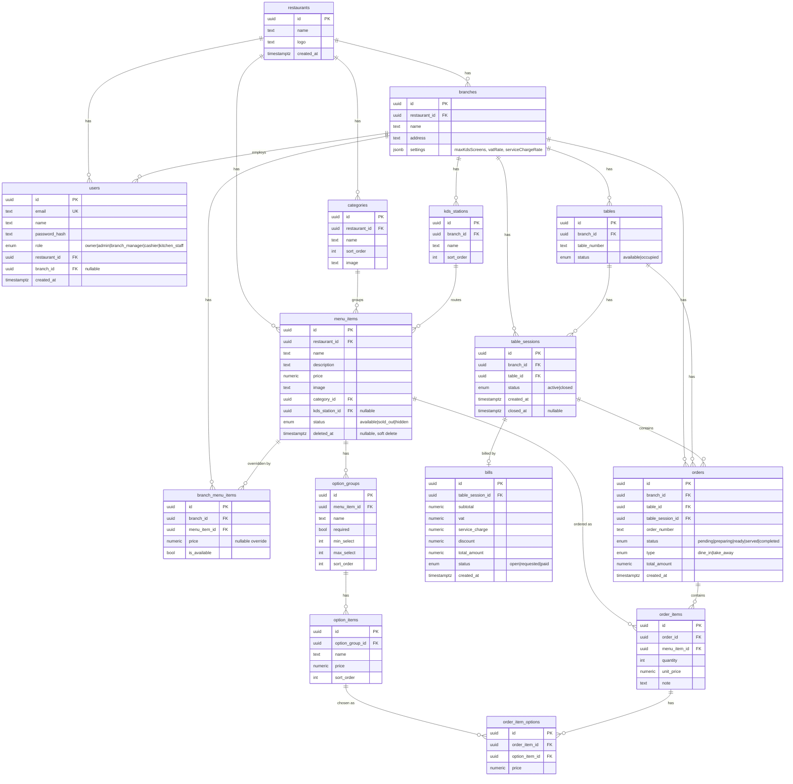

# RMS Database Diagram

Entity-relationship diagram generated from `src/db/schema.ts`.

```mermaid
erDiagram
    restaurants ||--o{ branches : has
    restaurants ||--o{ users : has
    restaurants ||--o{ categories : has
    restaurants ||--o{ menu_items : has

    branches ||--o{ users : "employs"
    branches ||--o{ tables : has
    branches ||--o{ table_sessions : has
    branches ||--o{ kds_stations : has
    branches ||--o{ branch_menu_items : has
    branches ||--o{ orders : has

    tables ||--o{ table_sessions : has
    tables ||--o{ orders : has

    table_sessions ||--o{ orders : contains
    table_sessions ||--o| bills : "billed by"

    categories ||--o{ menu_items : groups

    kds_stations ||--o{ menu_items : routes

    menu_items ||--o{ branch_menu_items : "overridden by"
    menu_items ||--o{ option_groups : has
    menu_items ||--o{ order_items : "ordered as"

    option_groups ||--o{ option_items : has

    option_items ||--o{ order_item_options : "chosen as"

    orders ||--o{ order_items : contains

    order_items ||--o{ order_item_options : has

    restaurants {
        uuid id PK
        text name
        text logo
        timestamptz created_at
    }

    branches {
        uuid id PK
        uuid restaurant_id FK
        text name
        text address
        jsonb settings "maxKdsScreens, vatRate, serviceChargeRate"
    }

    users {
        uuid id PK
        text email UK
        text name
        text password_hash
        enum role "owner|admin|branch_manager|cashier|kitchen_staff"
        uuid restaurant_id FK
        uuid branch_id FK "nullable"
        timestamptz created_at
    }

    tables {
        uuid id PK
        uuid branch_id FK
        text table_number
        enum status "available|occupied"
    }

    table_sessions {
        uuid id PK
        uuid branch_id FK
        uuid table_id FK
        enum status "active|closed"
        timestamptz created_at
        timestamptz closed_at "nullable"
    }

    categories {
        uuid id PK
        uuid restaurant_id FK
        text name
        int sort_order
        text image
    }

    kds_stations {
        uuid id PK
        uuid branch_id FK
        text name
        int sort_order
    }

    menu_items {
        uuid id PK
        uuid restaurant_id FK
        text name
        text description
        numeric price
        text image
        uuid category_id FK
        uuid kds_station_id FK "nullable"
        enum status "available|sold_out|hidden"
        timestamptz deleted_at "nullable, soft delete"
    }

    branch_menu_items {
        uuid id PK
        uuid branch_id FK
        uuid menu_item_id FK
        numeric price "nullable override"
        bool is_available
    }

    option_groups {
        uuid id PK
        uuid menu_item_id FK
        text name
        bool required
        int min_select
        int max_select
        int sort_order
    }

    option_items {
        uuid id PK
        uuid option_group_id FK
        text name
        numeric price
        int sort_order
    }

    orders {
        uuid id PK
        uuid branch_id FK
        uuid table_id FK
        uuid table_session_id FK
        text order_number
        enum status "pending|preparing|ready|served|completed"
        enum type "dine_in|take_away"
        numeric total_amount
        timestamptz created_at
    }

    order_items {
        uuid id PK
        uuid order_id FK
        uuid menu_item_id FK
        int quantity
        numeric unit_price
        text note
    }

    order_item_options {
        uuid id PK
        uuid order_item_id FK
        uuid option_item_id FK
        numeric price
    }

    bills {
        uuid id PK
        uuid table_session_id FK
        numeric subtotal
        numeric vat
        numeric service_charge
        numeric discount
        numeric total_amount
        enum status "open|requested|paid"
        timestamptz created_at
    }
```
